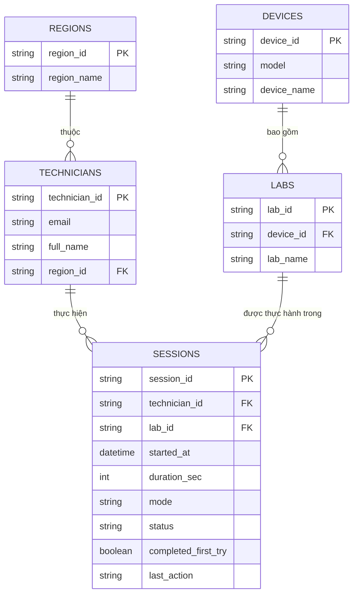

# Tài liệu Thiết kế Cơ sở Dữ liệu (Database Schema Documentation)

Tài liệu này mô tả chi tiết sơ đồ cơ sở dữ liệu quan hệ (RDBMS) chuẩn hóa **3NF**, áp dụng cho hệ thống **Dashboard Giám sát Thực hành KTV**.

---

## 1. Sơ đồ Quan hệ Thực thể (ERD Diagram)



---

## 2. Danh mục Bảng & Từ điển Dữ liệu (Data Dictionary)

### 2.1. Bảng `regions` (Danh mục Vùng miền)
Lưu trữ danh sách các vùng miền quản lý KTV trên toàn hệ thống.

| Tên trường | Kiểu dữ liệu | Khóa | Ràng buộc | Mô tả & Ví dụ |
| :--- | :--- | :--- | :--- | :--- |
| `region_id` | `VARCHAR(50)` | **PK** | `NOT NULL` | Mã định danh vùng miền (VD: `"REG_1"`) |
| `region_name` | `VARCHAR(100)` | | `NOT NULL` | Tên hiển thị vùng miền (VD: `"Vùng 1"`) |

---

### 2.2. Bảng `technicians` (Thông tin Kỹ thuật viên / Learners)
Lưu trữ thông tin chi tiết về từng KTV tham gia thực hành.

| Tên trường | Kiểu dữ liệu | Khóa | Ràng buộc | Mô tả & Ví dụ |
| :--- | :--- | :--- | :--- | :--- |
| `technician_id` | `VARCHAR(50)` | **PK** | `NOT NULL` | Mã KTV (VD: `"TECH_01"`) |
| `email` | `VARCHAR(100)` | | `NOT NULL, UNIQUE` | Email tài khoản KTV (VD: `"nguyenvana@fpt.com"`) |
| `full_name` | `VARCHAR(100)` | | `NOT NULL` | Họ và tên KTV (VD: `"Nguyễn Văn A"`) |
| `region_id` | `VARCHAR(50)` | **FK** | `REFERENCES regions` | Mã vùng miền KTV trực thuộc (VD: `"REG_1"`) |

---

### 2.3. Bảng `devices` (Danh mục Thiết bị)
Lưu trữ danh sách các thiết bị phần mạng / ONT phục vụ làm lab.

| Tên trường | Kiểu dữ liệu | Khóa | Ràng buộc | Mô tả & Ví dụ |
| :--- | :--- | :--- | :--- | :--- |
| `device_id` | `VARCHAR(50)` | **PK** | `NOT NULL` | Mã thiết bị (VD: `"DEV_01"`) |
| `model` | `VARCHAR(50)` | | `NOT NULL` | Mã model phần cứng (VD: `"AC1000F"`) |
| `device_name` | `VARCHAR(100)` | | `NOT NULL` | Tên thương mại / tên hiển thị (VD: `"ONT AC1000F"`) |

---

### 2.4. Bảng `labs` (Danh mục Bài Lab Thực hành)
Danh sách các bài lab thực hành thuộc từng loại thiết bị.

| Tên trường | Kiểu dữ liệu | Khóa | Ràng buộc | Mô tả & Ví dụ |
| :--- | :--- | :--- | :--- | :--- |
| `lab_id` | `VARCHAR(50)` | **PK** | `NOT NULL` | Mã bài lab (VD: `"LAB_DEV_01_01"`) |
| `device_id` | `VARCHAR(50)` | **FK** | `REFERENCES devices` | Mã thiết bị tương ứng (VD: `"DEV_01"`) |
| `lab_name` | `VARCHAR(150)` | | `NOT NULL` | Tên bài lab (VD: `"Cấu hình PPPoE"`) |

---

### 2.5. Bảng `sessions` (Nhật ký Phiên Thực hành / Submissions)
Lưu vết từng phiên bắt đầu và nộp bài lab của KTV.

| Tên trường | Kiểu dữ liệu | Khóa | Ràng buộc | Mô tả & Giá trị hợp lệ |
| :--- | :--- | :--- | :--- | :--- |
| `session_id` | `VARCHAR(50)` | **PK** | `NOT NULL` | Mã phiên làm lab (VD: `"SES_001"`) |
| `technician_id` | `VARCHAR(50)` | **FK** | `REFERENCES technicians` | KTV thực hiện bài lab (VD: `"TECH_01"`) |
| `lab_id` | `VARCHAR(50)` | **FK** | `REFERENCES labs` | Bài lab thực hiện (VD: `"LAB_DEV_01_01"`) |
| `started_at` | `DATETIME` / `TIMESTAMP` | | `NOT NULL` | Thời điểm bắt đầu phiên (VD: `"2026-07-01T08:15:00Z"`) |
| `duration_sec` | `INT` | | `DEFAULT 0` | Thời lượng thực hiện tính bằng giây (VD: `900` = 15 phút) |
| `mode` | `VARCHAR(30)` | | `CHECK (mode IN ('Thực hành', 'Hướng dẫn'))` | Chế độ làm lab |
| `status` | `VARCHAR(30)` | | `CHECK (status IN ('Hoàn thành', 'Đang làm', 'Chưa thực hiện'))` | Trạng thái ghi nhận bài nộp |
| `completed_first_try` | `BOOLEAN` | | `DEFAULT TRUE` | Đạt ngay lần đầu (true/false) |
| `last_action` | `TEXT` | | | Thao tác cuối cùng ghi nhận trên simulator |

---

## 3. Mã SQL DDL (Create Table Statements)

```sql
-- 1. Bảng Regions
CREATE TABLE regions (
    region_id VARCHAR(50) PRIMARY KEY,
    region_name VARCHAR(100) NOT NULL
);

-- 2. Bảng Technicians
CREATE TABLE technicians (
    technician_id VARCHAR(50) PRIMARY KEY,
    email VARCHAR(100) NOT NULL UNIQUE,
    full_name VARCHAR(100) NOT NULL,
    region_id VARCHAR(50) NOT NULL,
    CONSTRAINT fk_tech_region FOREIGN KEY (region_id) REFERENCES regions(region_id) ON DELETE CASCADE
);

-- 3. Bảng Devices
CREATE TABLE devices (
    device_id VARCHAR(50) PRIMARY KEY,
    model VARCHAR(50) NOT NULL,
    device_name VARCHAR(100) NOT NULL
);

-- 4. Bảng Labs
CREATE TABLE labs (
    lab_id VARCHAR(50) PRIMARY KEY,
    device_id VARCHAR(50) NOT NULL,
    lab_name VARCHAR(150) NOT NULL,
    CONSTRAINT fk_lab_device FOREIGN KEY (device_id) REFERENCES devices(device_id) ON DELETE CASCADE
);

-- 5. Bảng Sessions
CREATE TABLE sessions (
    session_id VARCHAR(50) PRIMARY KEY,
    technician_id VARCHAR(50) NOT NULL,
    lab_id VARCHAR(50) NOT NULL,
    started_at TIMESTAMP NOT NULL,
    duration_sec INT DEFAULT 0,
    mode VARCHAR(30) NOT NULL CHECK (mode IN ('Thực hành', 'Hướng dẫn')),
    status VARCHAR(30) NOT NULL CHECK (status IN ('Hoàn thành', 'Đang làm', 'Chưa thực hiện')),
    completed_first_try BOOLEAN DEFAULT TRUE,
    last_action TEXT,
    CONSTRAINT fk_session_tech FOREIGN KEY (technician_id) REFERENCES technicians(technician_id),
    CONSTRAINT fk_session_lab FOREIGN KEY (lab_id) REFERENCES labs(lab_id)
);
```

---

## 4. Cấu trúc Bảng `timer_sessions` (nguồn dữ liệu thực)

Dashboard lấy dữ liệu thực từ bảng `timer_sessions` (được tạo bởi `api/migrations/007_timer_sessions.sql`):

```sql
CREATE TABLE IF NOT EXISTS timer_sessions (
    id BIGSERIAL PRIMARY KEY,
    technician_id VARCHAR(50),
    name VARCHAR(100),
    email VARCHAR(100),
    started_at TIMESTAMPTZ,
    finished_at TIMESTAMPTZ,
    duration_sec INT,
    mode VARCHAR(30),
    device VARCHAR(100),
    lab_id VARCHAR(50),
    lab_name VARCHAR(150),
    created_at TIMESTAMPTZ NOT NULL DEFAULT NOW()
);
```

Ghi chú về mapping khi hiển thị:
- `learner` (KTV) lấy từ `email`, rồi tới `name`, rồi `technician_id`.
- `date`/`time` lấy từ `started_at` (fallback `finished_at` khi `started_at` trống).
- `status` mặc định `'completed'`; `completed_first_try` mặc định `true`.
- `region` (Khu vực/CNx) không nằm trong bảng → được gán bằng hàm hash `getLearnerRegion()` theo email trong frontend.

---

## 5. Tương thích với Mã nguồn Frontend (`js/app.js`)

API `GET /api/index.php/dashboard/all` trả về `{ sessions, devices, labs }`. Frontend xử lý như sau:

1. `loadDashboardFromApi()` gọi API, không dùng mock data.
2. `mapApiSessions()` chuẩn hóa mỗi phiên từ `timer_sessions` thành cấu trúc dùng cho UI (thời gian, KTV, thiết bị, bài lab, trạng thái).
3. `buildDeviceCatalog()` ghép danh sách thiết bị với bài lab theo `lab_id` → `device_id`.
4. Trường hợp API lỗi: dashboard hiển thị dữ liệu rỗng kèm thông báo "Không tải được dữ liệu timer_sessions" ở sidebar.
