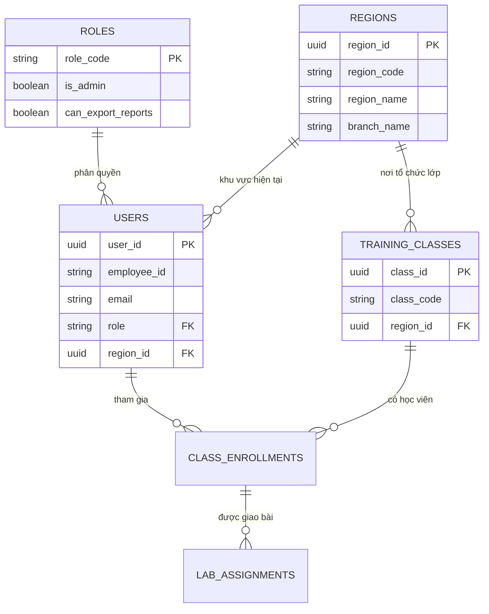

# KTV, khu vực, chi nhánh và lớp đào tạo

Tài liệu này mô tả nguồn dữ liệu hiện hành của dashboard. Schema vật lý được
quản lý bởi các migration trong `api/migrations/`.

## Quy tắc chính

Khu vực/chi nhánh hiện tại là thuộc tính của KTV, không phải thuộc tính suy ra
từ lớp đào tạo:



- `users.region_id -> regions.region_id`: nơi công tác hiện tại của KTV.
- `training_classes.region_id -> regions.region_id`: nơi tổ chức/quản lý lớp.
- Hai giá trị có thể khác nhau và không được dùng thay thế cho nhau.
- `lab_assignments.region_id_snapshot`: khu vực lịch sử tại lúc giao bài; chỉ
  dùng khi cần báo cáo lịch sử cố định.

## Cách đọc đơn giản

Migration `025_ktv_location_directory.sql` tạo view `v_ktv_directory`. Mỗi KTV
là một dòng đã có sẵn khu vực và chi nhánh:

```sql
SELECT employee_id,
       display_name,
       email,
       region_code,
       region_name,
       branch_name
  FROM v_ktv_directory
 ORDER BY region_name, branch_name, display_name;
```

Tra cứu một KTV:

```sql
SELECT *
  FROM v_ktv_directory
 WHERE LOWER(email) = LOWER('ktv@fpt.net');
```

Ứng dụng, API danh sách KTV và dashboard phải ưu tiên view này. Không cần join
qua `training_classes` để xem nơi công tác của KTV.

## Nguồn ghi dữ liệu

File roster cập nhật theo luồng:

1. `Parent Department` được chuẩn hóa thành một dòng trong `regions`.
2. `Branch` cập nhật `regions.branch_name` (`PNC` hoặc `TIN`).
3. `users.region_id` được gắn trực tiếp tới dòng `regions` tương ứng.
4. `users.region_code` và `users.dashboard_region` chỉ giữ giá trị nguồn để
   tương thích/import; chúng không phải nguồn đọc chính.

Khi sửa thủ công trong Django Admin, chọn trường **Khu vực/chi nhánh hiện tại**
của KTV. Không sửa khu vực của lớp để thay đổi nơi công tác của KTV.

## Vai trò của các bảng

| Bảng/view | Vai trò |
| --- | --- |
| `roles` | Danh mục `KTV`, `ADMIN`, `DEV` và quyền quản trị/xuất báo cáo |
| `users` | Hồ sơ KTV và `region_id` hiện tại |
| `regions` | Danh mục mã vùng, tên khu vực, tên chi nhánh |
| `v_ktv_directory` | Read-model phẳng để xem KTV + khu vực + chi nhánh |
| `training_classes` | Thông tin lớp; `region_id` là khu vực của lớp |
| `class_enrollments` | Quan hệ KTV tham gia lớp |
| `lab_assignments` | Bài được giao và snapshot lịch sử |
| `timer_sessions` | Nhật ký phiên thực hành |

## Phân quyền

`users.role` tham chiếu `roles.role_code`:

- `KTV`: sử dụng portal KTV, không có quyền quản trị hoặc xuất báo cáo.
- `ADMIN`: có toàn bộ quyền quản trị dashboard nhưng không được xuất báo cáo.
- `DEV`: có toàn bộ quyền như `ADMIN` và được xuất báo cáo.

API phải kiểm tra `roles.is_admin` cho chức năng quản trị và
`roles.can_export_reports` cho chức năng xuất báo cáo; không dựa riêng vào tên role.

## Quy tắc dashboard

- Danh sách và bộ lọc KTV: lấy khu vực/chi nhánh từ `v_ktv_directory`.
- Ma trận tiến độ hiện tại: dùng khu vực hiện tại của KTV từ
  `v_ktv_directory`; KTV chưa được gán khu vực hiển thị là chưa phân vùng.
- Báo cáo lịch sử cố định: có thể dùng `region_id_snapshot` nếu nghiệp vụ yêu
  cầu giữ nguyên khu vực tại thời điểm giao bài.
- Lớp hiện tại lấy từ `class_enrollments`/`training_classes`, nhưng không ghi đè
  khu vực hiện tại của KTV.
