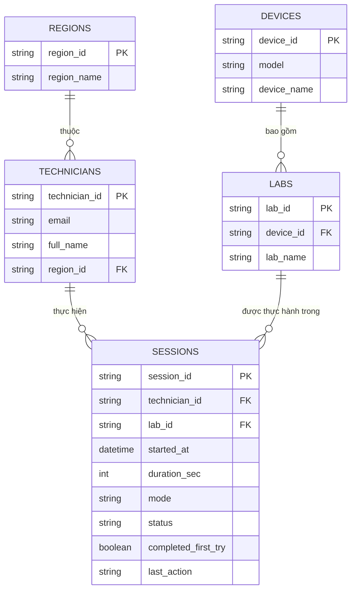

# Tài liệu Thiết kế Cơ sở Dữ liệu (Database Schema Documentation)

Tài liệu này mô tả chi tiết sơ đồ cơ sở dữ liệu quan hệ (RDBMS) chuẩn hóa **3NF**, áp dụng cho hệ thống **Dashboard Giám sát Thực hành KTV**.

> Phần 1–3 là mô hình nghiệp vụ tham chiếu. Schema vật lý đang chạy được mô tả ở phần 4 và được quản lý bởi các migration trong `api/migrations/`.

---

## 1. Sơ đồ Quan hệ Thực thể (ERD Diagram)



---

## 2. Danh mục Bảng & Từ điển Dữ liệu (Data Dictionary)

### 2.1. Bảng `regions` (Danh mục Vùng miền)
Lưu trữ danh sách các vùng miền quản lý KTV trên toàn hệ thống.

| Tên trường | Kiểu dữ liệu | Khóa | Ràng buộc | Mô tả & Ví dụ |
| :--- | :--- | :--- | :--- | :--- |
| `region_id` | `VARCHAR(50)` | **PK** | `NOT NULL` | Mã định danh vùng miền (VD: `"REG_1"`) |
| `region_name` | `VARCHAR(100)` | | `NOT NULL` | Tên hiển thị vùng miền (VD: `"Vùng 1"`) |

---

### 2.2. Bảng `technicians` (Thông tin Kỹ thuật viên / Learners)
Lưu trữ thông tin chi tiết về từng KTV tham gia thực hành.

| Tên trường | Kiểu dữ liệu | Khóa | Ràng buộc | Mô tả & Ví dụ |
| :--- | :--- | :--- | :--- | :--- |
| `technician_id` | `VARCHAR(50)` | **PK** | `NOT NULL` | Mã KTV (VD: `"TECH_01"`) |
| `email` | `VARCHAR(100)` | | `NOT NULL, UNIQUE` | Email tài khoản KTV (VD: `"nguyenvana@fpt.com"`) |
| `full_name` | `VARCHAR(100)` | | `NOT NULL` | Họ và tên KTV (VD: `"Nguyễn Văn A"`) |
| `region_id` | `VARCHAR(50)` | **FK** | `REFERENCES regions` | Mã vùng miền KTV trực thuộc (VD: `"REG_1"`) |

---

### 2.3. Bảng `devices` (Danh mục Thiết bị)
Lưu trữ danh sách các thiết bị phần mạng / ONT phục vụ làm lab.

| Tên trường | Kiểu dữ liệu | Khóa | Ràng buộc | Mô tả & Ví dụ |
| :--- | :--- | :--- | :--- | :--- |
| `device_id` | `VARCHAR(50)` | **PK** | `NOT NULL` | Mã thiết bị (VD: `"DEV_01"`) |
| `model` | `VARCHAR(50)` | | `NOT NULL` | Mã model phần cứng (VD: `"AC1000F"`) |
| `device_name` | `VARCHAR(100)` | | `NOT NULL` | Tên thương mại / tên hiển thị (VD: `"ONT AC1000F"`) |

---

### 2.4. Bảng `labs` (Danh mục Bài Lab Thực hành)
Danh sách các bài lab thực hành thuộc từng loại thiết bị.

| Tên trường | Kiểu dữ liệu | Khóa | Ràng buộc | Mô tả & Ví dụ |
| :--- | :--- | :--- | :--- | :--- |
| `lab_id` | `VARCHAR(50)` | **PK** | `NOT NULL` | Mã bài lab (VD: `"LAB_DEV_01_01"`) |
| `device_id` | `VARCHAR(50)` | **FK** | `REFERENCES devices` | Mã thiết bị tương ứng (VD: `"DEV_01"`) |
| `lab_name` | `VARCHAR(150)` | | `NOT NULL` | Tên bài lab (VD: `"Cấu hình PPPoE"`) |

---

### 2.5. Bảng `sessions` (Nhật ký Phiên Thực hành / Submissions)
Lưu vết từng phiên bắt đầu và nộp bài lab của KTV.

| Tên trường | Kiểu dữ liệu | Khóa | Ràng buộc | Mô tả & Giá trị hợp lệ |
| :--- | :--- | :--- | :--- | :--- |
| `session_id` | `VARCHAR(50)` | **PK** | `NOT NULL` | Mã phiên làm lab (VD: `"SES_001"`) |
| `technician_id` | `VARCHAR(50)` | **FK** | `REFERENCES technicians` | KTV thực hiện bài lab (VD: `"TECH_01"`) |
| `lab_id` | `VARCHAR(50)` | **FK** | `REFERENCES labs` | Bài lab thực hiện (VD: `"LAB_DEV_01_01"`) |
| `started_at` | `DATETIME` / `TIMESTAMP` | | `NOT NULL` | Thời điểm bắt đầu phiên (VD: `"2026-07-01T08:15:00Z"`) |
| `duration_sec` | `INT` | | `DEFAULT 0` | Thời lượng thực hiện tính bằng giây (VD: `900` = 15 phút) |
| `mode` | `VARCHAR(30)` | | `CHECK (mode IN ('Thực hành', 'Hướng dẫn'))` | Chế độ làm lab |
| `status` | `VARCHAR(30)` | | `CHECK (status IN ('completed', 'in_progress', 'failed', 'abandoned', 'not_started'))` | Trạng thái kỹ thuật của phiên |
| `completed_first_try` | `BOOLEAN` | | `NULL`, không có default | `TRUE/FALSE` khi có bằng chứng đánh giá; `NULL` khi chưa đủ dữ liệu |
| `last_action` | `TEXT` | | | Thao tác cuối cùng ghi nhận trên simulator |

---

## 3. Mã SQL DDL (Create Table Statements)

```sql
-- 1. Bảng Regions
CREATE TABLE regions (
    region_id VARCHAR(50) PRIMARY KEY,
    region_name VARCHAR(100) NOT NULL
);

-- 2. Bảng Technicians
CREATE TABLE technicians (
    technician_id VARCHAR(50) PRIMARY KEY,
    email VARCHAR(100) NOT NULL UNIQUE,
    full_name VARCHAR(100) NOT NULL,
    region_id VARCHAR(50) NOT NULL,
    CONSTRAINT fk_tech_region FOREIGN KEY (region_id) REFERENCES regions(region_id) ON DELETE CASCADE
);

-- 3. Bảng Devices
CREATE TABLE devices (
    device_id VARCHAR(50) PRIMARY KEY,
    model VARCHAR(50) NOT NULL,
    device_name VARCHAR(100) NOT NULL
);

-- 4. Bảng Labs
CREATE TABLE labs (
    lab_id VARCHAR(50) PRIMARY KEY,
    device_id VARCHAR(50) NOT NULL,
    lab_name VARCHAR(150) NOT NULL,
    CONSTRAINT fk_lab_device FOREIGN KEY (device_id) REFERENCES devices(device_id) ON DELETE CASCADE
);

-- 5. Bảng Sessions
CREATE TABLE sessions (
    session_id VARCHAR(50) PRIMARY KEY,
    technician_id VARCHAR(50) NOT NULL,
    lab_id VARCHAR(50) NOT NULL,
    started_at TIMESTAMP NOT NULL,
    duration_sec INT DEFAULT 0,
    mode VARCHAR(30) NOT NULL CHECK (mode IN ('Thực hành', 'Hướng dẫn')),
    status VARCHAR(30) NOT NULL CHECK (status IN ('completed', 'in_progress', 'failed', 'abandoned', 'not_started')),
    completed_first_try BOOLEAN,
    last_action TEXT,
    CONSTRAINT fk_session_tech FOREIGN KEY (technician_id) REFERENCES technicians(technician_id),
    CONSTRAINT fk_session_lab FOREIGN KEY (lab_id) REFERENCES labs(lab_id)
);
```

---

## 4. Schema vật lý hiện tại

Migration `012_employee_roster_dashboard.sql` mở rộng bảng IAM `users` bằng các trường hồ sơ chuyển tiếp cần lấy từ workbook nhân viên:

- Định danh và công việc: `employee_id`, `job_title`, `class_code`.
- Thời gian đào tạo: `training_start_date`, `training_end_date`.
- Trạng thái nghỉ việc: `is_terminated`, `termination_date`, `termination_reason`.
- Đơn vị: `unit_code`, `unit_name`, `region_code`, `branch_code`, `dashboard_region`.
- Truy vết đồng bộ: `employee_source`, `employee_seed_batch`, `employee_synced_at`.

`employee_id` có unique index riêng và vẫn giữ `user_id`, `email`, `role`, `iam_profile` để tương thích IAM.

Bảng `timer_sessions` có thêm:

- `user_id` tham chiếu `users(user_id)`.
- `status`, `completed_first_try`, `last_action` cho số liệu dashboard thực.
- `is_mock`, `seed_batch`, `seed_key` để dữ liệu test có thể kiểm tra và chạy lại an toàn.

Danh mục thiết bị và bài lab lấy từ `device_catalog` và `lab_catalog`. Dashboard join phiên theo `user_id`; các phiên cũ chưa có `user_id` được fallback bằng mã nhân viên hoặc email.

Migration `013_training_classes_and_session_outcomes.sql` bổ sung:

- `training_classes` và `class_enrollments` để lớp demo không ghi đè mã lớp nguồn trong `users.class_code`.
- View `v_current_training_class` để lấy lớp đang hiệu lực.
- `completed_first_try` trở thành nullable và không còn default `TRUE`; `NULL` có nghĩa chưa đủ bằng chứng đánh giá.
- Check constraint cho status, mode, duration và quan hệ giữa status với first-try.

Mô hình đích và đánh giá chi tiết nằm trong [DB_DASHBOARD_ASSESSMENT_2026-08-13.md](DB_DASHBOARD_ASSESSMENT_2026-08-13.md). Schema hiện tại vẫn là mô hình chuyển tiếp; cần `lab_assignments` và `lab_attempts` để tính tiến độ chương trình chính thức.

---

## 5. Tương thích với Mã nguồn Frontend (`js/app.js`)

API `GET /api/index.php/dashboard/all` trả về `{ sessions, devices, labs, technicians }`. Frontend xử lý như sau:

1. `loadDashboardFromApi()` gọi API, không dùng mock data.
2. `technicians` cung cấp tên, mã nhân viên, đơn vị và khu vực từ `users`; `class_code` lấy từ enrollment đang hiệu lực và `source_class_code` giữ lớp workbook.
3. `mapApiSessions()` chuẩn hóa mỗi phiên từ `timer_sessions` và ghép metadata KTV từ catalog trên.
4. `buildDeviceCatalog()` ghép danh sách thiết bị với bài lab theo `lab_id` → `device_id`.
5. Danh sách lớp được dựng từ `training_classes`/`class_enrollments`; DB là nguồn dữ liệu chính khi API có trường `technicians`.
6. Trường hợp API lỗi: dashboard hiển thị dữ liệu rỗng kèm thông báo "Không tải được dữ liệu timer_sessions" ở sidebar.

---

## 6. Nạp và xác minh dữ liệu KTV test

Workbook nhân viên không được chép vào repository. Chạy migration trước, sau đó truyền đường dẫn file vào CLI:

```powershell
php api/migrate.php
php api/seed_dashboard_ktv.php --file="D:\NhanVien-2026-08-13.xlsx" --count=200 --batch=dashboard-ktv-20260813 --anchor-date=2026-08-13 --replace-batch
php api/verify_dashboard_seed.php --batch=dashboard-ktv-20260813 --expected-users=200
```

Có thể thêm `--dry-run` vào lệnh seed để chỉ đọc workbook và lập kế hoạch, không ghi DB. `--replace-batch` chỉ thay dữ liệu mock/enrollment thuộc đúng batch đã chỉ định. Với 200 KTV, seed tạo 20 lớp demo × 10 KTV và vẫn giữ nguyên lớp nguồn trong hồ sơ.
