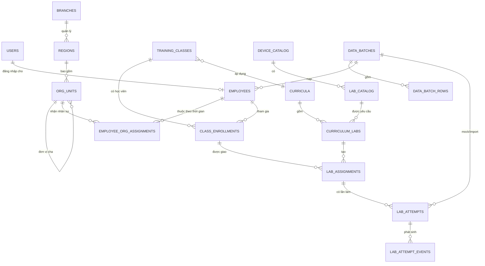

# Báo cáo đánh giá DB và Dashboard giả lập thiết bị

Ngày đánh giá: 13/08/2026  
Phạm vi: DB/API/dashboard trong `FTC-VirtualDevices`, workbook `NhanVien-2026-08-13.xlsx`, và schema tham chiếu của web giám sát KTV tại `KTVsupervisor/backend/schema.sql`.

## 1. Kết luận điều hành

1. Schema web giám sát KTV là nguồn tham khảo tốt cho phân cấp tổ chức, import có truy vết và audit; không nên sao chép nguyên trạng phần định danh người dùng, cách đặt tên quoted CamelCase, hoặc cách lưu lớp dưới dạng ghi chú/JSON.
2. Nguyên nhân tỷ lệ hoàn thành cũ luôn 100% đã được xác định chính xác: toàn bộ 2.986 phiên mock có `status = 'completed'`. Tracking thật và default DB cũng từng tự gán `completed_first_try = TRUE`.
3. Tỷ lệ đạt lần đầu trong batch cũ thực tế chỉ khoảng 83,1% ở chế độ Thực hành. Nếu giao diện cũ hiện 100% thì đó là lỗi đường dữ liệu/cache hoặc phiên bản API cũ, không phải giá trị thật trong batch.
4. Ma trận cũ chỉ có 0/100% vì lấy `số session completed / số session đã phát sinh`: ô có phiên đều 100%, ô chưa có phiên bị hiển thị sai thành 0%.
5. Đã giữ nguyên 43 mã lớp nguồn từ workbook để truy vết và tạo thêm 20 lớp demo cân bằng, mỗi vùng 2 lớp, mỗi lớp 10 KTV.
6. Đã áp dụng migration 013, nạp lại batch mock, sửa API và công thức dashboard. Dữ liệu Thực hành mới có xu hướng hoàn thành 73,2% → 80,0% → 87,7% và đạt lần đầu 69,5% → 75,0% → 80,5%.
7. Schema hiện tại sau migration 013 đủ cho demo đáng tin cậy hơn, nhưng chưa đủ để đo tiến độ đào tạo chính thức. Cần thêm `lab_assignments` và `lab_attempts` để mẫu số là bài được giao và “đạt lần đầu” được suy ra từ lịch sử lần làm.

## 2. Bằng chứng trước khi sửa

| Chỉ số | Giá trị cũ | Nguyên nhân |
|---|---:|---|
| KTV mock | 200 | Cân bằng 20 KTV cho 10 vùng |
| Lớp nguồn | 43 | Giữ trực tiếp `ghiChuXepLop` từ workbook |
| Quy mô lớp nguồn | 1–12, trung bình 4,65 | Không có bảng lớp/enrollment; nhiều lớp rất nhỏ và trải nhiều vùng |
| Phiên mock | 2.986 | Mỗi KTV có 10–20 lab khác nhau |
| Phiên có `completed` | 2.986/2.986 | Seed gán cứng toàn bộ là hoàn thành |
| Hoàn thành Thực hành 06/07/08 | 100% / 100% / 100% | Mẫu số chỉ gồm các phiên đã phát sinh và tất cả đều completed |
| Đạt lần đầu Thực hành | khoảng 83,1% | Cờ hash trong seed, không có lịch sử attempt chứng minh |
| Ô vùng × lab có dữ liệu | 533/540 | 533 ô đều 100%; 7 ô chưa có lượt bị UI ghi 0% |

Ba lỗi định nghĩa quan trọng:

- `completion = completed sessions / sessions` là tỷ lệ kết thúc phiên, không phải tiến độ hoàn thành chương trình.
- `first_try = boolean` không chứng minh được lần làm thứ nhất; một dòng `false` không có attempt thất bại đi trước là dữ liệu thiếu lịch sử.
- Ô không có dữ liệu không đồng nghĩa 0% hoàn thành. Phải hiển thị `—`, `N/A` hoặc `Chưa có dữ liệu` tùy việc bài đã được giao hay chưa.

## 3. Đánh giá schema web giám sát KTV tham chiếu

Schema tham chiếu có 35 bảng, gồm khoảng 25 bảng nghiệp vụ và 10 bảng Django/auth. Các cụm chính:

- Tổ chức: `ChiNhanh` → `Vung` → `DonVi`, trong đó `DonVi` hỗ trợ quan hệ cha–con.
- Nhân sự/giám sát: `NhanVien`, `GiamSatVien`, `Role`, `ChucVu`.
- Nghiệp vụ giám sát: `MauQuyDinh` → `DanhMuc` → `TieuChi`; `PhieuGiamSat` → `PhieuKetQua`.
- Phân công tháng: `KTVSupervisionAssignment`, có unique theo KTV/năm/tháng.
- Import/audit: request, item, batch, detail log, before/after và raw JSON.

### Nên kế thừa

- Chuẩn hóa phân cấp chi nhánh–vùng–đơn vị và khóa ngoại rõ ràng.
- Tách master data khỏi transaction data.
- Lưu batch import, từng dòng nguồn, lỗi validation và before/after để truy vết.
- Dùng unique/check/index cho các quy tắc nghiệp vụ quan trọng.
- Có thực thể phân công thay vì suy ra công việc phải làm từ nhật ký đã phát sinh.

### Không nên sao chép nguyên trạng

- `auth_user`, `GiamSatVien` và `NhanVien` có nguy cơ tạo nhiều bản ghi định danh cho cùng một người.
- Lớp vẫn nằm trong `NhanVien.ghiChuXepLop` và danh sách JSON của import, chưa phải mô hình class/enrollment.
- Tên quoted CamelCase làm SQL nhạy chữ hoa/thường và khó bảo trì.
- Một số status/check còn lỏng; khóa tự nhiên làm PK sẽ khó đổi mã.
- Thiếu lịch sử hiệu lực của đơn vị/lớp, nên báo cáo quá khứ có thể đổi khi nhân viên chuyển vùng.
- Nhiều index phục vụ framework, không nhất thiết phù hợp truy vấn dashboard giả lập.

## 4. Schema mục tiêu đề xuất



### 4.1. Định danh và tổ chức

| Bảng | Trường chính | Ghi chú |
|---|---|---|
| `users` | `user_id UUID PK`, `email CITEXT UNIQUE`, `role`, `iam_subject`, `iam_profile` | Chỉ chứa tài khoản/IAM, không chứa toàn bộ hồ sơ nhân viên |
| `employees` | `employee_id`, `user_id UNIQUE NULL FK`, họ tên, email, chức danh, trạng thái làm việc | Một nhân viên có thể chưa có tài khoản; một tài khoản gắn tối đa một nhân viên |
| `branches` | `branch_id`, `branch_code UNIQUE`, `branch_name` | Tương đương `ChiNhanh` |
| `regions` | `region_id`, `branch_id FK`, `region_code UNIQUE`, tên, `dashboard_group` | Không dùng chuỗi tên vùng làm khóa tổng hợp |
| `org_units` | `unit_id`, `region_id FK`, `parent_unit_id FK`, mã/tên | Hỗ trợ cây đơn vị |
| `employee_org_assignments` | `employee_id`, `unit_id`, `valid_from`, `valid_to` | Lịch sử vùng/đơn vị theo hiệu lực; chỉ một assignment hiện hành |

### 4.2. Lớp và chương trình

| Bảng | Trường chính | Ghi chú |
|---|---|---|
| `training_classes` | `class_id`, `class_code UNIQUE`, tên, vùng, ngày bắt đầu/kết thúc, sức chứa, giảng viên, status | Đã triển khai bản chuyển tiếp trong migration 013 |
| `class_enrollments` | `class_id`, `employee_id/user_id`, `valid_from/to`, status, `source_class_code` | Giữ lớp nguồn, cho phép một KTV học nhiều cohort theo thời gian |
| `curricula` | `curriculum_id`, mã, version, tên, hiệu lực | Đóng băng phiên bản chương trình |
| `curriculum_labs` | `curriculum_id`, `lab_id`, `required_mode`, bắt buộc, thứ tự, hạn tương đối | Xác định mẫu số lab phải hoàn thành |
| `class_lab_assignments` | `class_id`, `curriculum_lab_id`, `assigned_at`, `due_at`, status | Lịch giao chung cho lớp; có thể override theo KTV |

### 4.3. Assignment, attempt và kết quả

`lab_assignments` cần là thực thể trung tâm của báo cáo:

```text
assignment_id PK
enrollment_id FK
curriculum_lab_id FK
assigned_at, due_at
status: assigned | in_progress | passed | expired | waived
first_pass_attempt_no NULL
completed_at NULL
region_id_snapshot, unit_id_snapshot, class_id_snapshot
UNIQUE(enrollment_id, curriculum_lab_id)
```

`lab_attempts` lưu từng lần làm, không lưu một cờ first-try mặc định:

```text
attempt_id PK
assignment_id FK
attempt_no CHECK >= 1
mode: practice | guide
status: in_progress | completed | failed | abandoned
outcome: passed | failed | NULL
started_at, finished_at, duration_seconds
score, error_count, last_action
source_event_key UNIQUE
data_batch_id FK NULL
UNIQUE(assignment_id, mode, attempt_no)
```

`lab_attempt_events` là log tùy chọn cho checkpoint/action. Nếu dung lượng lớn, nên partition theo tháng của `event_time`.

### 4.4. Import và dữ liệu test

Thay các chuỗi `seed_batch` rời rạc bằng:

- `data_batches(batch_id, batch_type, source_name, source_checksum, status, created_by, created_at)`.
- `data_batch_rows(batch_id, row_number, source_key, raw_data JSONB, validation_errors JSONB, target_table, target_id)`.
- Các bảng transaction tham chiếu `data_batch_id` để xóa/rollback chính xác một batch test.

Không chép workbook nhân sự có dữ liệu cá nhân vào repository.

## 5. Định nghĩa KPI chuẩn

### 5.1. Tiến độ hoàn thành

```text
Số assignment Thực hành đã pass
-------------------------------- × 100
Số assignment Thực hành được giao/đến hạn
```

- Đếm distinct assignment, không đếm số lần làm.
- Hướng dẫn không đi vào KPI kết quả Thực hành.
- Có thể tách “được giao” và “đến hạn” thành hai KPI nếu nghiệp vụ cần.

### 5.2. Đạt lần đầu

```text
Số assignment đã pass với first_pass_attempt_no = 1
---------------------------------------------------- × 100
Số assignment đã pass có đủ lịch sử attempt
```

- Fail lần 1 rồi pass lần 2: hoàn thành = có, đạt lần đầu = không.
- Không có evidence: `NULL/không đủ dữ liệu`, không tự quy thành `TRUE` hoặc `FALSE`.

### 5.3. Ma trận khu vực × lab

Schema đích:

```text
Distinct KTV đã pass lab
------------------------- × 100
Distinct KTV được giao lab
```

- `0 assigned` hiển thị `N/A/Chưa giao`.
- `assigned > 0` nhưng chưa ai pass mới là `0%`.
- Khu vực cha phải cộng tử số/mẫu số rồi chia; không lấy trung bình phần trăm của vùng con.
- Retake của cùng KTV không tăng mẫu số.
- Dùng `region_id_snapshot`, không join vùng hiện tại để sửa lại lịch sử quá khứ.

Trong giai đoạn chuyển tiếp chưa có assignment, dashboard hiện dùng `distinct KTV hoàn thành / tổng KTV đang hoạt động trong vùng` và ghi rõ ô chưa phát sinh là `—`. Đây là proxy tốt hơn công thức cũ, nhưng chưa thay thế được assignment thật.

## 6. Phương án chia 200 KTV

- 10 vùng, mỗi vùng đúng 20 KTV.
- Mỗi vùng có 2 lớp A/B, mỗi lớp 10 KTV.
- Tổng cộng 20 lớp: `SIM-2608-<REGION>-A/B`.
- Trong từng vùng, KTV được sắp theo đơn vị/lớp nguồn rồi phân round-robin A/B để hai lớp cân bằng, không cắt một cụm nguồn vào cùng một lớp.
- `users.class_code` vẫn giữ mã lớp nguồn; lớp demo hiện hành nằm trong `training_classes` và `class_enrollments`.
- API trả `class_code` là lớp demo và `source_class_code` là lớp workbook.

Ví dụ: `SIM-2608-DBB-A`, `SIM-2608-DBB-B`, `SIM-2608-TDDT-PNC-A`, `SIM-2608-TDDT-PNC-B`.

## 7. Thay đổi đã áp dụng

### DB/API

- Thêm migration `013_training_classes_and_session_outcomes.sql`.
- Thêm `training_classes`, `class_enrollments`, view `v_current_training_class`, constraint/index cần thiết.
- Bỏ `NOT NULL DEFAULT TRUE` của `timer_sessions.completed_first_try`; `NULL` nghĩa là chưa có evidence.
- Thêm check cho status, mode, duration và quan hệ first-try/status.
- Tracking API nhận `status` và `completed_first_try` tùy chọn, không còn hardcode mọi phiên là đạt lần đầu.
- Dashboard API dùng lớp đang hiệu lực nhưng vẫn trả lớp nguồn.

### Seed và kiểm tra

- Seed tạo 20 lớp × 10 KTV, idempotent theo đúng batch.
- Batch mock có `completed`, `in_progress`, `failed`, `abandoned`; chỉ completed mới có evidence first-try.
- Hướng dẫn không mang kết quả first-try.
- Verifier kiểm tra checksum migration, class size, enrollment duy nhất, orphan, mode, số lab/KTV, status mix, first-try và cell tỷ lệ trung gian.

### Dashboard

- KPI, xu hướng tháng và so sánh kỳ dùng cùng cohort Thực hành.
- `failed` hiển thị “Không đạt”, `abandoned` hiển thị “Đã dừng”, không còn giả thành “Đang làm”.
- Parse boolean chặt chẽ; chuỗi `"false"` không bị JavaScript biến thành true.
- Poll signature có status/first-try và file JS có cache-buster.
- Ma trận hiển thị `KTV hoàn thành / KTV trong vùng`; ô không dữ liệu hiển thị `—`.

## 8. Kết quả xác minh sau sửa

| Kiểm tra | Kết quả |
|---|---:|
| Migration 012/013 checksum | Khớp DB |
| KTV / vùng | 200 / 10, mỗi vùng 20 |
| Lớp demo / enrollment | 20 / 200 |
| Quy mô lớp demo | 10–10 |
| Lớp nguồn được giữ | 43 mã; API trả đủ cho 200 KTV |
| Phiên mock | 2.986 |
| Lab/KTV / mode/KTV | 10–20 / đủ 2 mode |
| Orphan user / lab | 0 / 0 |
| Status | 2.484 completed; 191 in-progress; 157 failed; 154 abandoned |
| Phiên Thực hành | 2.167 |
| Thực hành hoàn thành | 1.731 = 79,9% |
| Đạt lần đầu trong số completed | 1.298 = 75,0% |
| Ô vùng × lab có tỷ lệ session trung gian | 287 |
| API end-to-end | 200 KTV; 20 lớp; 10 KTV/lớp; lớp nguồn đủ 200 |

Theo tháng ở chế độ Thực hành:

| Tháng | Hoàn thành phiên | Đạt lần đầu trong completed |
|---|---:|---:|
| 06/2026 | 73,2% | 69,5% |
| 07/2026 | 80,0% | 75,0% |
| 08/2026 | 87,7% | 80,5% |

Các tỷ lệ trên là dữ liệu test có kiểm soát để dashboard thể hiện được nhiều trạng thái; không phải kết quả đánh giá nhân sự thật.

## 9. Đánh giá DB/dashboard hiện tại

| Hạng mục | Đánh giá | Nhận xét |
|---|---|---|
| Danh mục thiết bị/lab | Khá | Đã tách catalog; cần version/effective date và FK đầy đủ |
| IAM và hồ sơ nhân viên | Trung bình | Đã link bằng `user_id`, nhưng hồ sơ nhân viên/tổ chức vẫn dồn vào `users` |
| Lớp học | Khá ở mức demo | Đã có class/enrollment hiệu lực; chưa có curriculum và lịch giảng viên đầy đủ |
| Tracking kết quả | Yếu–trung bình | Flat `timer_sessions` chưa thể chứng minh assignment/retry/checkpoint |
| Chất lượng dữ liệu test | Khá | Deterministic, idempotent, có batch và verifier; cần mock attempt thật ở bước tiếp theo |
| Độ đúng KPI | Trung bình | Đã bỏ hardcode và thống nhất mode; tiến độ thật vẫn thiếu mẫu số assignment |
| Ma trận | Khá ở mức chuyển tiếp | Không còn 0/100 giả; mẫu số hiện là toàn bộ KTV vùng, chưa phải KTV được giao lab |
| Khả năng mở rộng | Trung bình–yếu | `/dashboard/all` trả toàn bộ session và browser tự tổng hợp; dữ liệu lớn sẽ chậm |
| Lịch sử tổ chức/lớp | Trung bình | Lớp đã effective-dated; vùng/đơn vị và snapshot attempt chưa có |
| Audit/import | Trung bình–yếu | Có seed batch nhưng chưa có row-level lineage/before-after như schema tham chiếu |

## 10. Lộ trình đề xuất

### P0 — đúng nghiệp vụ KPI

1. Thêm `curricula`, `curriculum_labs`, `class_lab_assignments`, `lab_assignments`.
2. Khôi phục mô hình attempt/result tương đương ý tưởng tốt từng có ở migration 006; không dùng lại nguyên bảng cũ đã bị migration 007 drop.
3. Simulator gửi `attempt_id`, `attempt_no`, outcome/checkpoint hoặc source event idempotency key.
4. Backfill session hiện tại thành attempt; chỉ dựng assignment khi có quy tắc curriculum rõ ràng.

### P1 — đúng lịch sử và hiệu năng

1. Tách `employees`, `branches`, `regions`, `org_units`, `employee_org_assignments` khỏi `users`.
2. Snapshot class/region/unit trên assignment hoặc attempt.
3. Tạo API aggregate theo `from`, `to`, `mode`, `region_id`, `class_id`; không tải toàn bộ session.
4. Tạo materialized view theo ngày/tháng nếu dữ liệu lớn; refresh có kiểm soát.

### P2 — vận hành và quản trị dữ liệu

1. Thêm `data_batches`, `data_batch_rows`, checksum file, raw row, validation error và audit before/after.
2. Chuẩn hóa email bằng `CITEXT`, mã trạng thái bằng enum/check thống nhất, catalog có version.
3. Partition event/attempt lớn theo tháng; bổ sung retention cho mock/event chi tiết.
4. Thêm contract test API và test công thức: retry, unassigned, assigned-zero-pass, chuyển vùng/lớp.

Không nên sửa migration 001–013 đã áp dụng. Mọi bước tiếp theo cần là migration cộng thêm (014 trở đi), có backfill, kiểm tra song song và kế hoạch ngừng dùng cột legacy.
