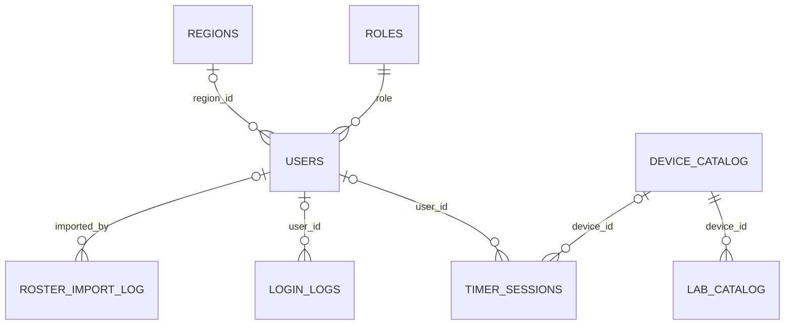

# Quan hệ dữ liệu FTC

Tài liệu này mô tả schema `public` đang được sử dụng sau migration `026`.
Các model trong `admin_app/admin_portal/models.py` đều có `managed = False`;
schema PostgreSQL vẫn được quản lý bởi các migration SQL trong `api/migrations`.

## Sơ đồ quan hệ nghiệp vụ

| Bảng nguồn | Cột | Bảng đích | Cột đích | Khi xóa bản ghi đích |
|---|---|---|---|---|
| `users` | `role` | `roles` | `role_code` | `RESTRICT` |
| `users` | `region_id` | `regions` | `region_id` | `NO ACTION` |
| `timer_sessions` | `user_id` | `users` | `user_id` | `SET NULL` |
| `timer_sessions` | `device_id` | `device_catalog` | `device_id` | `SET NULL` |
| `login_logs` | `user_id` | `users` | `user_id` | `SET NULL` |
| `roster_import_log` | `imported_by` | `users` | `user_id` | `SET NULL` |
| `lab_catalog` | `device_id` | `device_catalog` | `device_id` | `CASCADE` |

## Khóa chuẩn và dữ liệu snapshot

- `users.role`, `users.region_id`, `timer_sessions.user_id` và
  `timer_sessions.device_id` là khóa chuẩn dùng để join.
- `timer_sessions.technician_id`, `email`, `name`, `device`, `lab_name` là
  snapshot tại thời điểm ghi nhận. Chúng chỉ được dùng làm fallback khi khóa
  chuẩn tương ứng là `NULL`.
- `login_logs.email`, `role` và `session_id_hash` là snapshot audit. Không ánh
  xạ chúng thành foreign key vì người dùng, vai trò hoặc phiên có thể thay đổi
  hay hết hạn sau khi log được tạo.
- `users.region_code` và `dashboard_region` là cột tương thích dữ liệu cũ;
  `users.region_id` mới là quan hệ khu vực chính thức.
- `timer_sessions.lab_id` hiện khớp `lab_catalog.lab_id` trong dữ liệu đang có,
  nhưng schema chưa khai báo foreign key. Vì vậy ORM vẫn giữ trường này dưới
  dạng chuỗi cho tới khi có migration riêng quy định chính sách lưu lịch sử.

## Lưu ý định danh người dùng

Primary key vật lý của `users` là `email`; `user_id` có unique index và là cột
được mọi foreign key nghiệp vụ tham chiếu. Django Admin dùng `user_id` làm định
danh ORM ổn định. Không đổi định danh này nếu chưa có migration đồng bộ schema,
API, URL Admin và dữ liệu tham chiếu.

`auth_user` là tài khoản đăng nhập Django Admin, còn `users` là người dùng nghiệp
vụ FTC. Hai bảng độc lập và không có foreign key trực tiếp.
